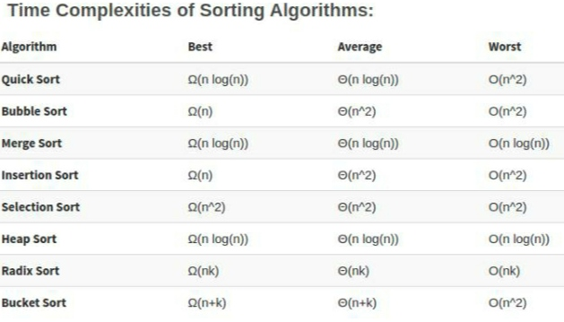

# DO NO MAKE ANY CHANGES TO THIS!

<a href="https://drive.google.com/drive/folders/1vNSf9q5-TF2zmVolHR95-B8dsrC3AU8o?usp=sharing">Recording Drive Link</a><br>
<a href="https://drive.google.com/drive/folders/1POOljj8SoRmq78JFCn38h_wj7G0vIiE5">Recording Drive Link</a><br>


## Complexities





## Technical Interview questions


```
Difference between java and C++
Diffrence between python and C++
Difference between C and C++
Why is python interpreted ?
Java is platform independent or dependent  , why?
This pointer 
While pointer
Void or null m difference
Super class
Oops concepts
Virtual function
All types of inheritance
Overloading
Function overriding 
Constructor or method m difference
Run time polymorphism
Moderators
Header files
Recursion
Use of recursion
What is DBMS 
What is normalisation
Keys m kuch bhi 
Joins all in DBMS
Dba
What is stack ,, applications 
What is queue ,,applications
Fastest searching algo
Complexities of algo 
Comparisons of algo
Or project k upr agr .... Ml ya fltter ya or bhi kuch web development use kiya hai to .. javascript se questions puch rhi thi
Data independence
Os m deadlock ki conditions
What is data structure
Python 
Tuples
Dictionary
Set
List
Difference between
Mutable and immutable
Modules in python
Storage classes in c
Basic functionality of os
Linked list all types kuch bhi ... applications
Dbms m acid property
Binary search vs linear search
What is algorithm
What is data structure
```


## Basic Links ##


<a href="https://bit.ly/Aptitudestudymaterial">Aptitude</a><br>
<a href="https://drive.google.com/file/d/1FMdN_OCfOI0iAeDlqswCiC2DZzD4nPsb/view">Drive for Questions of DSA</a><br>
<a href="https://drive.google.com/drive/folders/1SkCOcAS0Kqvuz-MJkkjbFr1GSue6Ms6m">Placement Material</a><br>
<a href="https://www.geeksforgeeks.org/c-programming-language/">c-programming-language</a><br>
<a href="https://www.geeksforgeeks.org/competitive-programming-a-complete-guide/">competitive-programming-a-complete-guide</a><br>
<a href="https://practice.geeksforgeeks.org/topic-tags/">topic-tags</a><br>
<a href="https://ssup.co/google/com/dhlP">Drive Link for AI ML</a><br>
<a href="https://drive.google.com/drive/folders/12fCh5ld1-5yONwnfVB7c5tQDxSD9CPvs?usp=sharing">FOP Material Link</a>
<a href="https://drive.google.com/drive/folders/1COM-RS_aZHqG5gqmVbmBW4KiKnR_FFs_">Day 1 FoP</a><br>
<a href="https://drive.google.com/drive/folders/1PgvZ9SygbIyqsh4VXcoej6NK0SMlv2si">Day 2 FoP</a><br>
<a href="https://drive.google.com/drive/folders/1Z_1jeiI6SfeTHrSlwMO7pX1_eokaM4tH">Drive for CS</a><br>
<a href="https://drive.google.com/drive/folders/1Z_1jeiI6SfeTHrSlwMO7pX1_eokaM4tH">CS Drive</a><br>
<a href="https://drive.google.com/drive/u/0/folders/1VPWYoeijlfdIMbYw3w-TVuOXGKRwDbCF">Placemement Related Material</a><br>
<a href="https://ssup.co/mega/nz/56D5">150 Interview Problems</a><br>
<a href="https://ssup.co/mega/nz/9W5l">Systems Design Fundamentals</a><br>
<a href="https://ssup.co/mega/nz/BU1Z">Data Structures Crash Course</a><br>
<a href="https://shrinke.me/VDheSFhF">Become an Algorithms Expert</a><br>
<a href="https://ssup.co/mega/nz/5IcS">Interview Preparation Part 1</a><br>
<a href="https://ssup.co/mega/nz/MEMv">Interview Preparation Part 2</a><br>
<a href="https://shrinke.me/IFvH">Interview Tips</a><br>
<a href="https://www.javatpoint.com/networking-interview-questions">networking-interview-questions</a><br>
<a href="https://www.geeksforgeeks.org/commonly-asked-operating-systems-interview-questions-set-1/">commonly-asked-operating-systems-interview-questions</a><br>


# Important


```
Hello all,

I am sharing some reliable resources with you and I can also guarantee the credibility (because I also gone through these resources)

Happy Learning 🙂 !!!

1.) C programming fundamentals : https://youtube.com/playlist?list=PLNutulngj0C4X0xGmFpQSLXol_zDAiAwh

2.) DSA fundamentals : https://youtube.com/playlist?list=PLVlQHNRLflP8IGz6OXwlV_lgHgc72aXlh

3.) Complexities & Sorting : https://youtube.com/playlist?list=PLCgWmBFaDpLhZNsvkluDOdPT7rVOOJtGP

4.) OOPS Core Concepts : https://youtube.com/playlist?list=PLCZJSEiJwWZ4XZFDktKqSV3vcAiau4xpV

5.) RDBMS (Till lecture 41) : https://youtube.com/playlist?list=PLxCzCOWd7aiFAN6I8CuViBuCdJgiOkT2Y

6.) Coding Platforms : https://leetcode.com/ & 
https://edyst.com/

Note : for Coding platforms no paid course required you can simple explore problems an try them here

All the Best 👍
```
